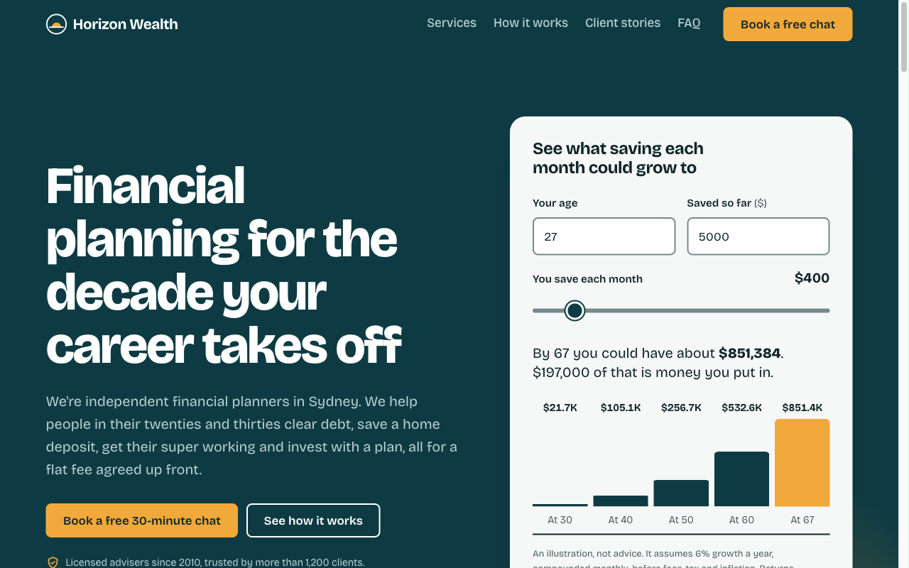

# financialplanning

A one-page marketing site for **Horizon Wealth Planning**, a demo financial planning firm in Sydney aimed at people in their twenties and thirties.

**Live site:** https://shakuarai.github.io/financialplanning/



The whole site lives in [`index.html`](index.html): the HTML, the CSS in a `<style>` tag and plain JavaScript in a `<script>` tag. It uses no frameworks, build tools or external JS or CSS libraries.

## What's on the page

- **Header:** sticky navigation with a "Book a free chat" button. The link for the section you're viewing is underlined. Below 1024px the links move into a menu.
- **Hero:** headline, calls to action and a savings calculator. You enter your age, what you've saved and a monthly amount, and a bar chart shows what it could grow to by 30, 40, 50, 60 and 67.
- **Services:** six things the firm helps with, from clearing debt to tax.
- **How it works:** the four steps from a free chat to a yearly check-in.
- **Client stories:** a testimonials carousel showing 1, 2 or 3 cards depending on screen width.
- **Free checklist:** an email-only sign-up for a first-home deposit checklist (the lead magnet).
- **FAQ:** common first questions, using native `<details>` elements.
- **Contact:** an enquiry form with validation for every field. Errors are announced to screen readers.
- **Footer:** page links, contact details, social links and a general advice warning.

## Accessibility

- Every text colour pair meets WCAG AA contrast, and form borders and icons meet the 3:1 non-text minimum.
- Nothing relies on colour alone. Errors show an icon and a message, the active nav link and carousel dot change shape, and chosen options show a tick. The palette (teal and saffron) stays distinguishable for red-green and blue-yellow colour blindness and in greyscale.
- The page has a skip link, visible focus rings, 44px tap targets, labelled controls and a reduced-motion mode.

## Security

The site is static, so the main risks are script injection and third-party requests. It has these protections:

- **Content-Security-Policy:** set in a `<meta>` tag. It allows only this page's own inline style and script (by SHA-256 hash), plus Google Fonts. Everything else is blocked, including other scripts, plugins, form submissions and network requests.
- **Trusted Types:** the page's JS never builds HTML from strings. It uses `textContent` and clones `<template>` elements, so the CSP can switch on Trusted Types.
- **Limited third parties:** the only external requests are for the font. Avatars are initials, and the old hero photo is gone.
- **Other hardening:** a strict referrer policy, `rel="noopener noreferrer"` on external links, and `maxlength` on every text field.

GitHub Pages can't set HTTP headers, so protections that only work as headers aren't possible here. Those include `frame-ancestors` (clickjacking), HSTS and `X-Content-Type-Options`. Add them if the site moves to a host that lets you set headers.

## SEO

- The page has one H1 and a logical heading order, plus a descriptive title and meta description.
- It has a canonical URL and Open Graph tags for link previews.
- It includes `FinancialService` structured data (JSON-LD) with the address, phone and opening hours.
- The content is written around what young professionals search for (first home, super, HECS, investing).

The site has no `robots.txt` or sitemap, because on a GitHub Pages project site crawlers only read those from the domain root. Submit the URL in Google Search Console instead.

## Running it

There's nothing to install or build. Open the file in a browser:

```sh
open index.html
```

## Editing

- Colours, type sizes and spacing are CSS custom properties on `:root`.
- The CSS, HTML and JS are divided by numbered comment banners, such as `/* 9. TESTIMONIALS CAROUSEL */`.
- Icons are `<symbol>`s in the SVG sprite at the top of `<body>`. Use one with `<svg><use href="#i-name"/></svg>`.
- The calculator's growth rate and milestone ages are the `data-rate` and `data-milestones` attributes on `#calc`.

**After editing the `<style>` or `<script>` block, update the CSP hashes**, or the browser will block the changed block:

```sh
python3 tools/csp-hashes.py          # rewrite the hashes
python3 tools/csp-hashes.py --check  # just check them
```

Some things must change together across the CSS, HTML and JS:

- **Carousel:** the cards per view in `perView()` must match the `.carousel__slide` `flex-basis` at each breakpoint.
- **Navigation:** the menu switches to inline links at 1024px in both the CSS and `initNav()`.
- **Enquiry form:** each field needs a validator, an `#{name}-error` element and an entry in the submitted data, all keyed by the field's `name`.

## Deployment

The site is hosted on GitHub Pages. On every push to `main`, the workflow in [`.github/workflows/pages.yml`](.github/workflows/pages.yml) publishes `index.html` only, so the rest of the repo isn't served.

## Demo limitations

This is a front-end demo and isn't ready for production:

- Neither form sends data anywhere. They only log it to the browser console, and the enquiry form fakes a 1.5-second request.
- The business, contact details, fees, client stories and social links are placeholders, and so are the details in the structured data.
- The calculator is an illustration with a fixed 6% growth rate, not financial advice.
